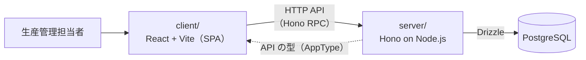

# Architecture

現時点で決まっている範囲のアーキテクチャをまとめる。未定の項目は「未定」と明記し、決まり次第この文書と ADR（`docs/adr/`）を更新する。

## 決定事項

| 項目                 | 決定                                              |
| -------------------- | ------------------------------------------------- |
| 言語                 | TypeScript（Backend / Frontend とも）             |
| Backend              | Hono                                              |
| Backend の実行環境   | Node.js                                           |
| Frontend             | React + Vite（SPA）                               |
| Database             | PostgreSQL                                        |
| ORM                  | Drizzle                                           |
| API の型共有         | Hono RPC                                          |
| パッケージ管理       | pnpm workspaces（monorepo）                       |
| テスト               | Vitest（Backend / Frontend とも）                 |
| 構成                 | Frontend と Backend を分離し、HTTP API で通信する |
| ディレクトリ         | `client/`（Frontend）、`server/`（Backend）       |

## 全体構成



- 業務ルール（工程順序、設備能力など）は Backend で守る。Frontend は表示と入力に専念する
- 同時更新の整合性は Backend と PostgreSQL で守る（方法は `LEARNING.md` Step 5 で検討する）
- Frontend は Backend の API の型だけを参照する。Backend の実装コード（Domain Model など）は Frontend から import しない

## リポジトリ構成（pnpm workspaces）

1 つのリポジトリに `client/` と `server/` の 2 パッケージを置き、pnpm workspaces でまとめて管理する。

```text
smart-koutei/
├── package.json          # ルート。全体で使うスクリプトと開発ツール
├── pnpm-workspace.yaml   # どのディレクトリをパッケージとして扱うかを宣言
├── client/
│   └── package.json      # Frontend のパッケージ
└── server/
    └── package.json      # Backend のパッケージ
```

pnpm workspaces でできること:

- ルートで `pnpm install` を 1 回実行すると、`client/` と `server/` の依存がまとめて入る
- `pnpm --filter server <script>` のように、特定のパッケージだけでコマンドを実行できる
- パッケージ同士を `"server": "workspace:*"` のように依存に書くと、npm に公開せずにローカルのパッケージを参照できる

この構成で pnpm workspaces を使う理由は、Hono RPC のため。Hono RPC では Frontend が Backend の型（`AppType`）を import する必要があり、`client` から `server` を workspace 依存として参照すればそれができる。

## Hono RPC の仕組み

1. `server/` でルートを定義し、その型を `export type AppType = typeof routes` として公開する
2. `client/` で `hc<AppType>(baseUrl)` を使ってクライアントを作る
3. Frontend から API を呼ぶと、パス・リクエスト・レスポンスに型が付く。Backend 側の変更で Frontend が壊れると、型エラーとして検出できる

API の型を手で書いたり、OpenAPI から生成したりする必要がない。その代わり、Frontend と Backend がどちらも TypeScript で、同じリポジトリにあることが前提になる。

## Drizzle の位置付け

Drizzle のスキーマ定義は Data Model（テーブル構造）を表す。Domain Model とは区別する。

- Drizzle のスキーマ（テーブル定義）は `LEARNING.md` Step 6 で設計する
- Domain Model（Step 3）を Drizzle の型で代用しない。Domain Model と Data Model がどう違うかは、Step 6 の必須成果物として説明する

## 未定事項

| 項目                               | 候補                                    | 決めるタイミング                          |
| ---------------------------------- | --------------------------------------- | ----------------------------------------- |
| Frontend のルーティング / データ取得 | React Router / TanStack Router / TanStack Query など | Step 7（最小実装）の前                    |
| Backend の内部構成（レイヤー分け） | —                                       | Step 3〜4（Domain Model / Aggregate）の後 |
| Node.js のバージョン               | —                                       | Step 7 の前                               |
| 認証・インフラ・デザインシステム   | 原則扱わない                            | —                                         |

Backend の内部構成は、Domain Model と Aggregate Boundary が決まる前に決めない。層の分け方を先に決めると、設計がその型に引きずられるため。

## 判断メモ: Frontend のビルド / フレームワーク

Backend を Hono で別に立てる前提で比較する。

| 候補                              | 特徴                                                           | この構成でのトレードオフ                                                                                                              |
| --------------------------------- | -------------------------------------------------------------- | ------------------------------------------------------------------------------------------------------------------------------------- |
| Vite + React（SPA）               | ビルドツールのみ。ルーティングなどは別ライブラリで選ぶ         | Hono と役割が重ならない。仕組みが少なく、学習の焦点（Domain / Data Model）がぶれにくい。SEO や SSR は使えないが、業務アプリなので不要 |
| Next.js                           | SSR / Server Components / API Routes を含むフレームワーク      | Next.js 自体がサーバーを持つため、Hono との役割分担を決める必要がある。学習テーマと関係しない仕組みが増える                           |
| React Router v7（framework mode） | ルーティング・データ取得を含むフレームワーク。SPA モードもある | Next.js よりは軽いが、Vite 単体より覚えることが多い                                                                                   |

**Vite + React（SPA）に決定。** Backend を Hono で分けているため、Frontend 側にサーバー機能は要らない。また、テストに Vitest を使うので、Vite と設定を共有しやすい。

Vite はビルドツールのみなので、ルーティングやデータ取得のライブラリは別途選ぶ（未定事項を参照）。
